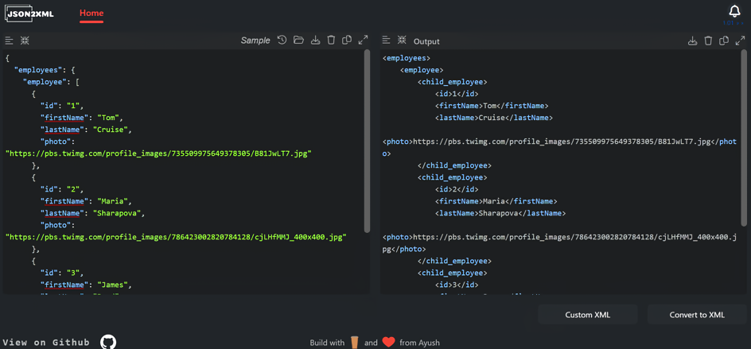

# 
 
[JSON2XML](https://ayush1920.github.io/json2xml/)

The project converts json to xml in browser and is a pure implementation in javascript and reactjs which can run independently as a web application also.\
It is inspired from [Codebeautify jsontoxml](https://codebeautify.org/jsontoxml#) application and implements other json customization functions on top of it. 
  
 

## Features

The project features json highlighting and convertion with other option to beautify json and option to updload from your local system. 

### | Beautify JSON
Indents and beautify json text. 

### | Compress JSON
Removes extra spacing and padding from json text and minifies it. 

### | Sample
Load a sample json already present in the application. 

### | History
Toggle between previous loaded json and the current text. 

### | Open from file
Open a json file from your local system. Files are limited to 1 MB to prevent browser from running out of memory while formatting and highlighting. The limit can be updated by modifying the `FILE_SIZE_LIMIT` variable in `/src/js/constants.js` file. 

### | Download
Download the json file to your local system. 

### | Clear
Clears the input code area. 

### | Copy
Copy text to clipboard. 

### | Expand input code area
Expands the code area to fill the entire width of the screen.  

`Similar features are implemented for output code block.`
### `Custom XML option is there for a recuring personal use and can be customized by updating "convertToXML" function in HomePage.`  

## Dependencies

### [xmltodict](https://github.com/martinblech/xmltodict/blob/master/xmltodict.py)
The project also includes a modified javascript port of popular python library `xmltodict` under MIT Licence. You can find it under `/src/js/dict2xml`. Feel free to use and update it.

### [Prism js](https://prismjs.com/)
Prism js is used for syntax highlighting in json and xml.

### [Indent js](https://zebzhao.github.io/indent.js/)
Indenting xml code is facilitated by Indent js.
